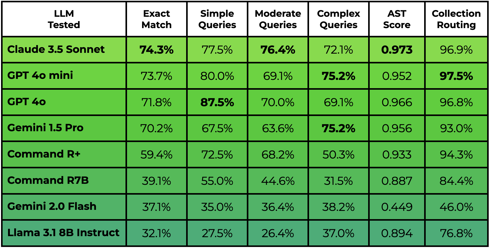
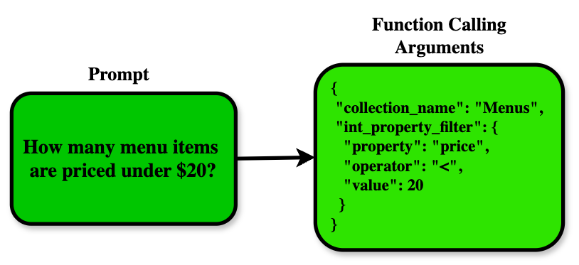
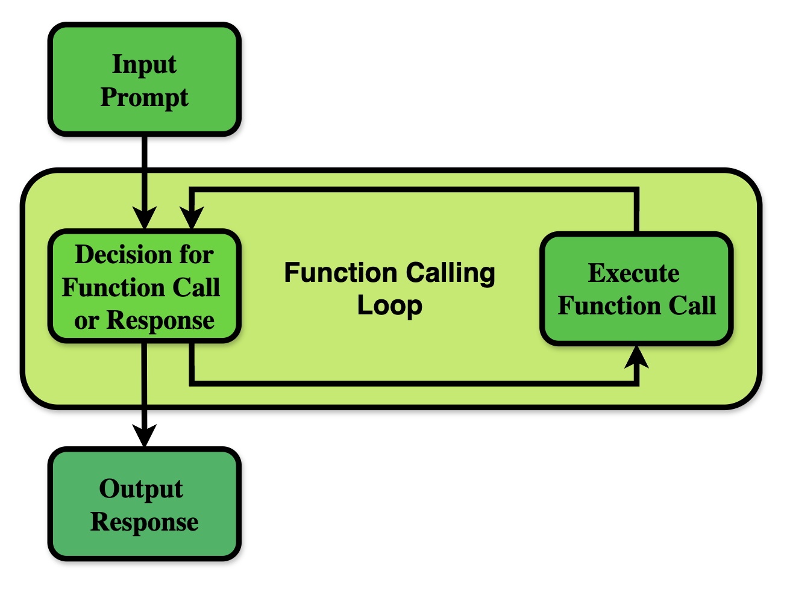
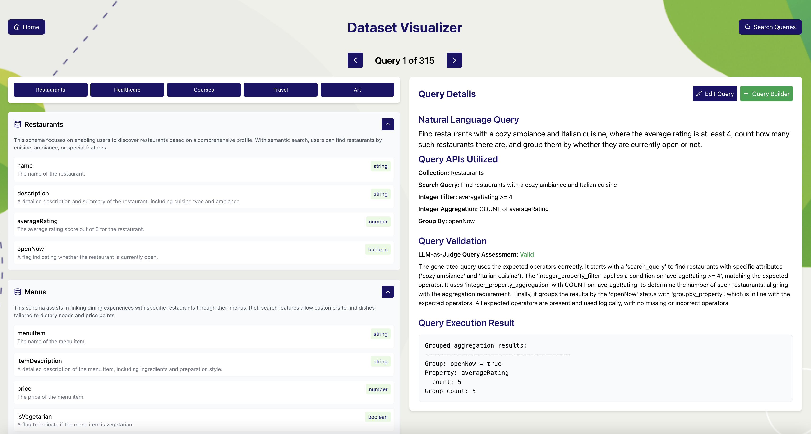
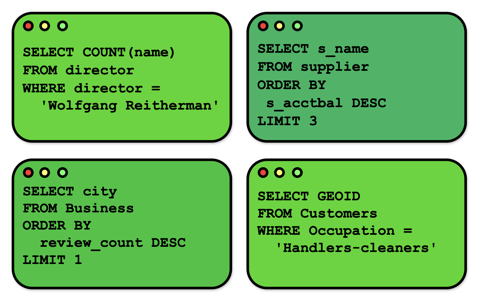

# Weaviate Gorilla

The capabilities of Large Language Models (LLMs) are rapidly accelerating largely thanks to their integration with external tools. Querying databases is among the most effective of these integrations, enabling LLMs to access private or continually updating data. This repo benchmarks how well Large Language Models can utilize Weaviate's query APIs in the Function Calling framework. The following result table summarizes our most recent experimental results.

## Natural Language Commands to Weaviate Queries

Illustrated below, the Weaviate Gorilla translates natural language commands into Weaviate queries.

## Function Calling

Defined in [OpenAI’s developer documentation](https://platform.openai.com/docs/guides/function-calling), "function calling enables developers to connect language models to external data and systems. You can define a set of functions as tools that the model has access to, and it can use them when appropriate based on the conversation history. You can then execute those functions on the application side, and provide results back to the model.

## Synthetic Data Generation

This repo additionally contains a visualization app for inspecting synthetic queries for testing Weaviate Query writing. For more info, please see `/app`!

## Pydantic is the new SQL

Our work explores a hypothesis that Pydantic, and their use in Structured LLM Outputs, is the new SQL. Pydantic models in frameworks such as Function Calling define tool arguments as a JSON-valued custom object. We can easily use this to format reliable database queries with LLMs, this further limits the risk of SQL injection attacks with Text-to-SQL systems.

The following image depicts synthetic queries from the BIRD dataset, one of the most popular Text-to-SQL datasets used in academic research.

## News

🔬 Querying Databases with Function Calling on ArXiv - [link](https://arxiv.org/abs/2502.00032)

🎙️ Shishir Patil and Tianjun Zhang on the Weaviate Podcast - [link](https://www.youtube.com/watch?v=HUtYOLX7HZ4)

🎥 Fine-tuning LLMs to use Weaviate's GraphQL APIs on Weaviate Youtube - [link](https://www.youtube.com/watch?v=Zqxd1BnoQQQ)

📝 Fine-tuning LLMs to use Weaviate's GraphQL APIs on the Weaviate Blog - [link](https://weaviate.io/blog/weaviate-gorilla-part-1)

🎥 Gorilla LLM Explained on Weaviate YouTube - [link](https://www.youtube.com/watch?v=LkV5DTRNxAg)

🎥 SQL-PaLM Explained on Weaviate YouTube - [link](https://www.youtube.com/watch?v=g3ocV0a_G2c)

