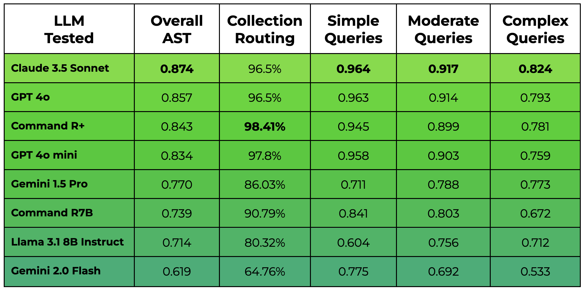
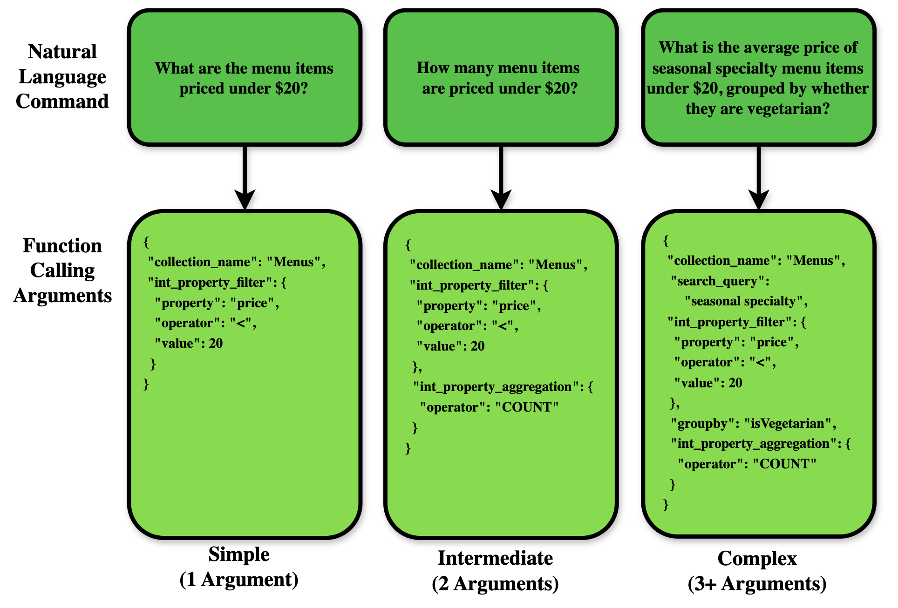

# Weaviate Gorilla

The capabilities of Large Language Models (LLMs) are rapidly accelerating largely thanks to their integration with external tools. Querying databases is among the most effective of these integrations, enabling LLMs to access private or continually updating data. This repo benchmarks how well Large Language Models can utilize Weaviate's query APIs in the Function Calling framework. The following result table summarizes our most recent experimental results.

## Natural Language Commands to Weaviate Queries

Illustrated below, the Weaviate Gorilla translates natural language commands into Weaviate queries. We separate Weaviate queries into 3 categories of difficulty (simple, moderate, complex) based on how many unique query operators they require.

## News

🎙️ Shishir Patil and Tianjun Zhang on the Weaviate Podcast - [link](https://www.youtube.com/watch?v=HUtYOLX7HZ4)

🎥 Fine-tuning LLMs to use Weaviate's GraphQL APIs on Weaviate Youtube - [link](https://www.youtube.com/watch?v=Zqxd1BnoQQQ)

📝 Fine-tuning LLMs to use Weaviate's GraphQL APIs on the Weaviate Blog - [link](https://weaviate.io/blog/weaviate-gorilla-part-1)

🎥 Gorilla LLM Explained on Weaviate YouTube - [link](https://www.youtube.com/watch?v=LkV5DTRNxAg)

🎥 SQL-PaLM Explained on Weaviate YouTube - [link](https://www.youtube.com/watch?v=g3ocV0a_G2c)

