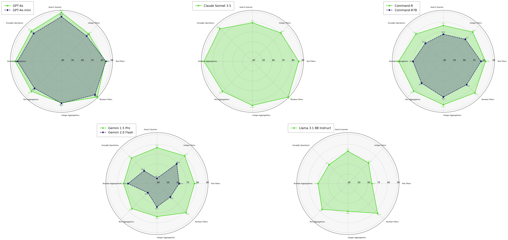

# Weaviate Gorilla

The Weaviate Gorilla project is a collection of research experiments in two core concepts: 

(1) Agents and Function Calling with Weaviate

(2) Creating synthetic training and testing data with Generative Feedback Loops

## News

📝 Weaviate Gorilla Part 1 GraphQL APIs on the Weaviate Blog - [link](https://weaviate.io/blog/weaviate-gorilla-part-1)

🎙️ Shishir Patil and Tianjun Zhang on the Weaviate Podcast - [link](https://www.youtube.com/watch?v=HUtYOLX7HZ4)

